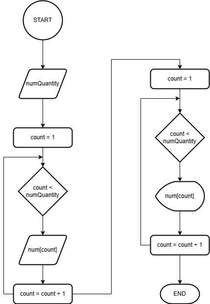
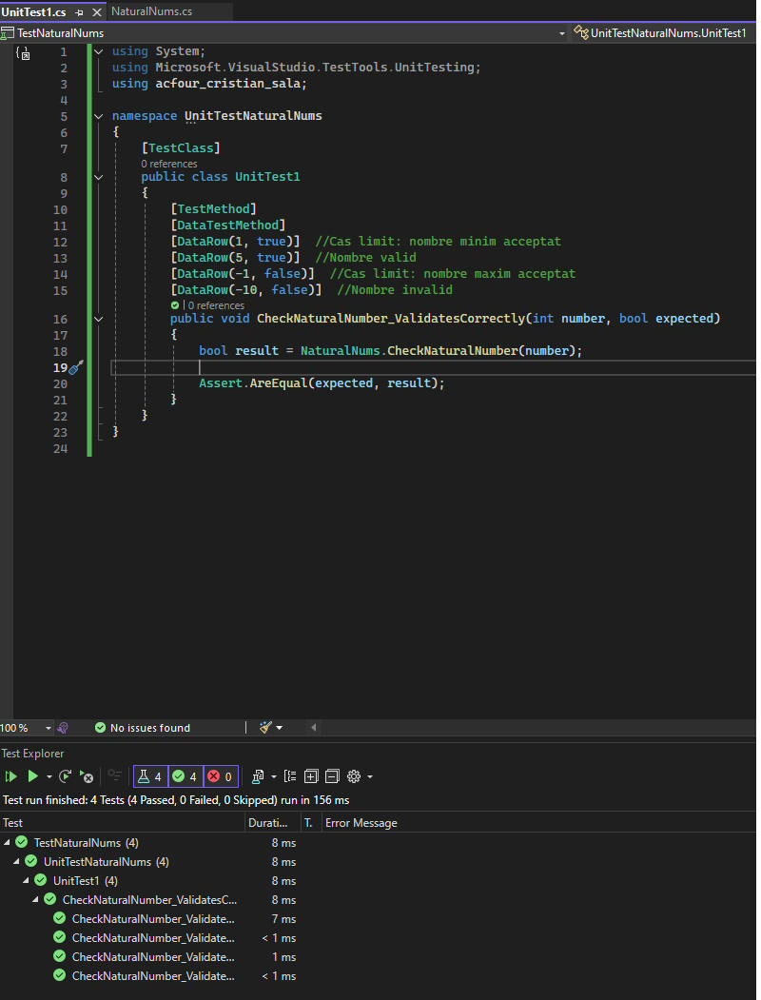

# acfour_cristian_sala

## 03- Flowchart 

 

## 06 - Unit testing

### Casos de prova: 

Métode CheckNaturalNumber:
```cs
private static bool CheckNaturalNumber(int number)
{
    return number > MinNum;
}
```
- Nombres Naturals vàlids (edge case inclós):
  - Si un nombre es > 0, s'espera el resultat: true
- Nombres invàlids: 
  - Qualsevol nombre <= 0, s'espera el resultat: false

 